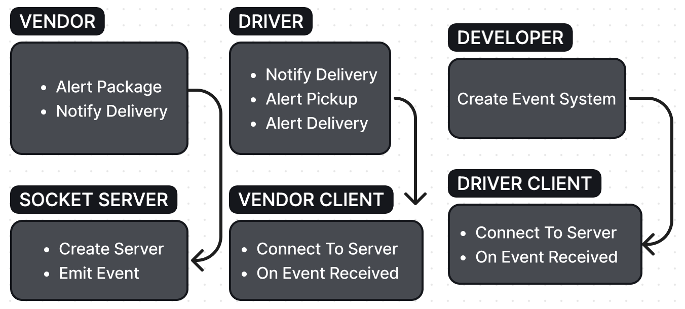
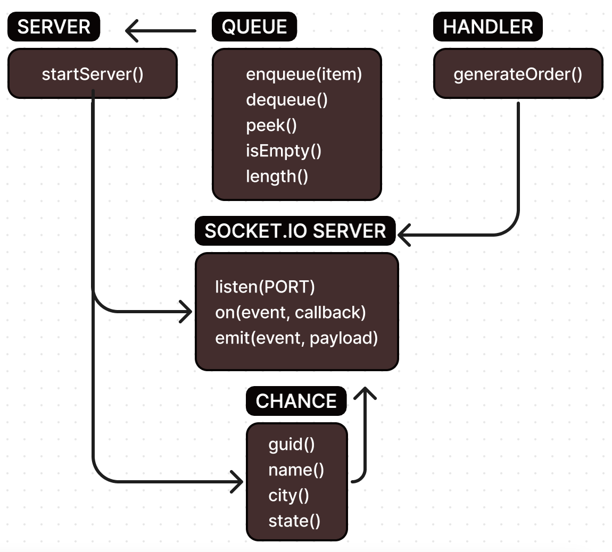

# The Code Academy Parcel Service

**Author**: Wajiha Khan

**Version**: 1.0.0

**Overview**:

Phase 1 of the CAPS system, built in Node.js, is undergoing its first phase. The focus is on establishing an event pool and handler functions. Users, like vendors and drivers, can interact with the system to manage package pickup, transit, and delivery. Developers aim to maintain clean code and utilize industry standards for state management and event-driven architecture.

**Version**: 2.0.0

**Overview**:

Phase 2 of CAPS involves migrating to Socket.io for improved networking, aiming to enhance communication efficiency between clients and servers. While maintaining core functionalities, the focus shifts to establishing a robust networking layer. User stories remain, with a technical emphasis on application refactoring. The overarching goal is to implement a network event-driven system using Socket.io. Lab objectives include setting up a Socket.io event server, configuring Vendor and Driver Client Modules, and managing event traffic within the 'caps' namespace for seamless package tracking and delivery management.

**Version**: 3.0.0

**Overview**:

Phase 3 introduces a package delivery system where a server facilitates communication between vendors and drivers using Socket.IO. Vendors generate orders, which are queued and dispatched by the server to drivers upon readiness. Drivers simulate package pickup and delivery, updating the server on their progress. Vendors receive delivery notifications from the server, showcasing an event-driven architecture for streamlined package management.

