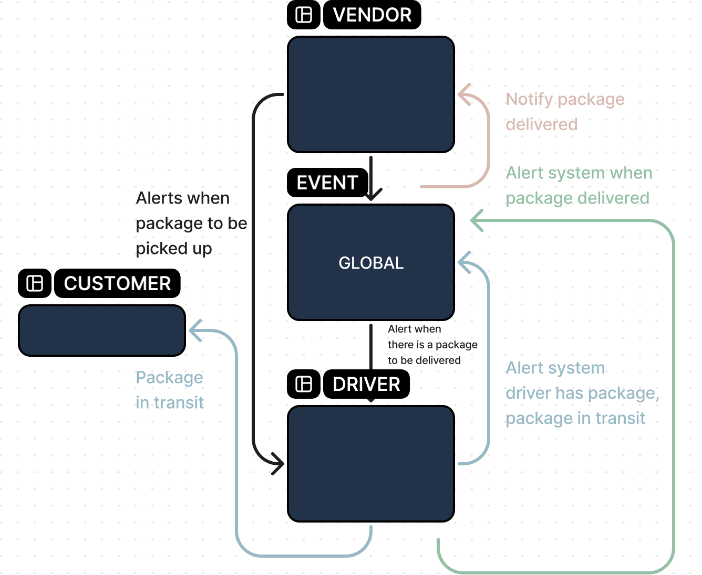

# The Code Academy Parcel Service

**Author**: Wajiha Khan

**Version**: 1.0.0

**Overview**:

    - The CAPS system, built in Node.js, is undergoing its first phase. The focus is on establishing an event pool and handler functions. Users, like vendors and drivers, can interact with the system to manage package pickup, transit, and delivery. Developers aim to maintain clean code and utilize industry standards for state management and event-driven architecture.

